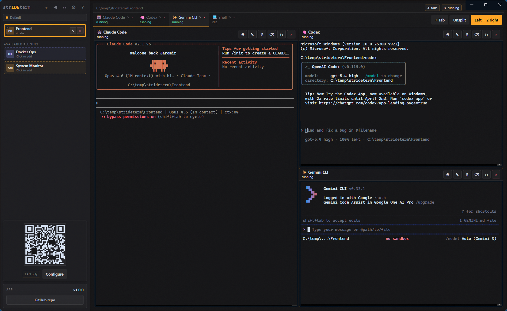
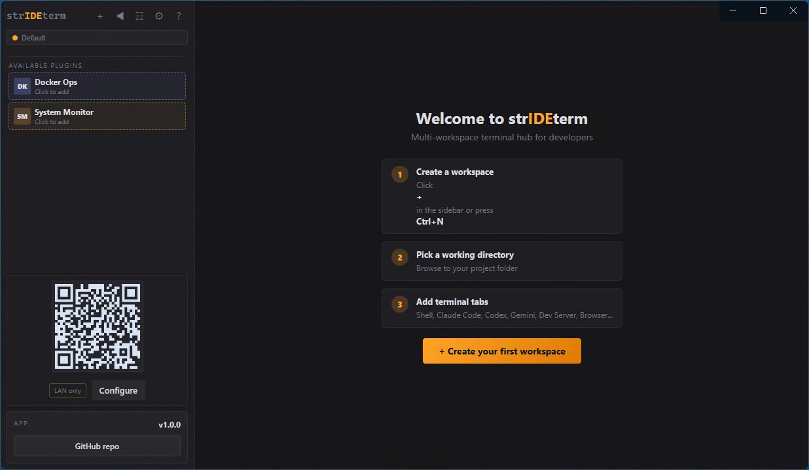
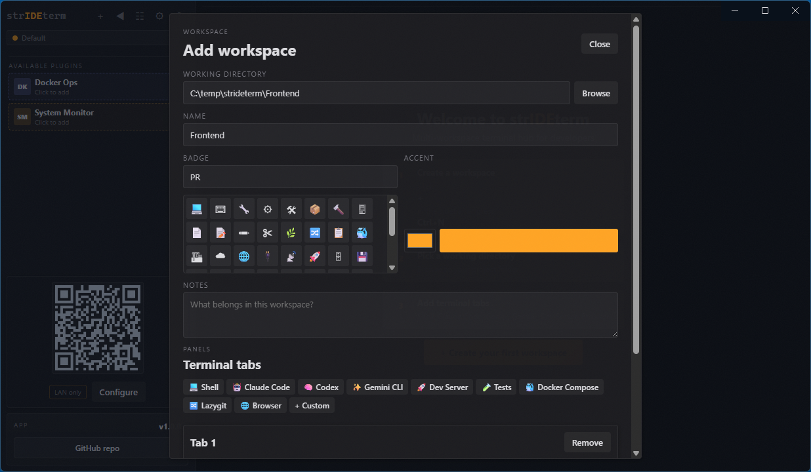
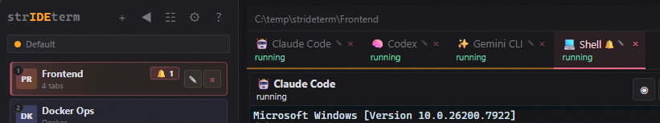
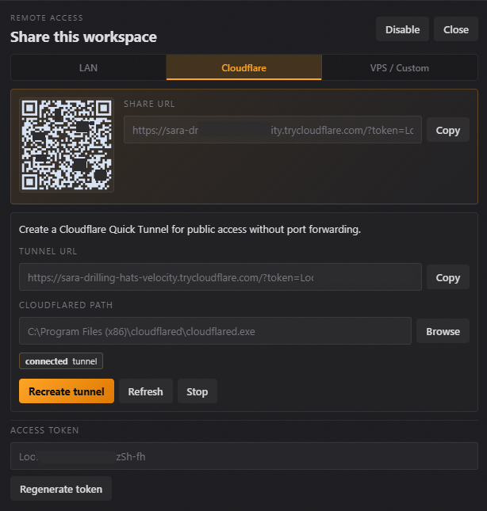
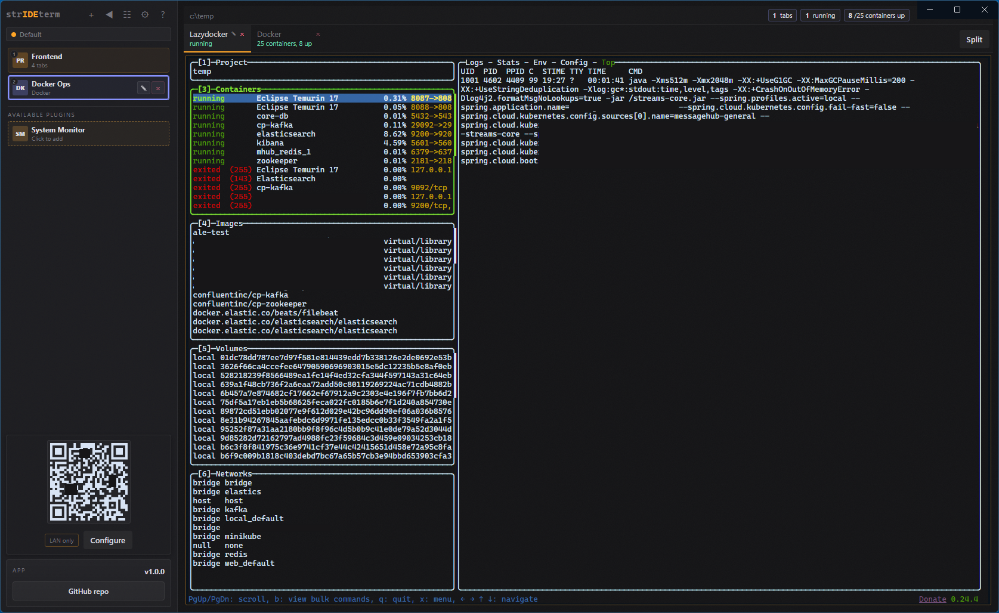

# strIDEterm

Stop losing terminals in a mess of scattered windows. strIDEterm puts all your shells, AI coding agents, Docker, Git, and browsers in one organized place — so you always know where everything is and can focus on the work, not the chaos.



## Features

- **Workspaces** - organize projects into separate workspaces, each with its own terminal tabs, working directory, and settings
- **Tab Templates** - quickly add Shell, Claude Code, Codex, Gemini CLI, Dev Server, Files, and other preset tabs
- **File Manager** - browse, preview, and edit files with an expandable tree, resizable panels, and right-click context menu (copy, rename, delete)
- **Embedded Browser** - open web pages directly in a tab with URL bar and navigation controls
- **Profiles** - switch between different sets of workspaces (e.g. Work, Personal, Client projects) with colored profile bar
- **Split Layouts** - arrange terminals in columns, rows, or a grid — see everything at once without switching tabs
- **Git Integration** - branch info, dirty count, commit log, worktree creation, and Lazygit support
- **Azure DevOps PR Review** - pull request inbox grouped by repo, managed review workspaces, AI agent integration (review + fix code), push & publish workflow, and MCP bridge — see [docs](docs/azure-devops-review.md)
- **GitHub PR Review** - pull request inbox, managed review workspaces with local checkout, comment and review submission (Approve / Request Changes / Comment), push & publish workflow, and MCP bridge for AI agents — see [docs](docs/github-pr-review.md)
- **Docker Manager** - list containers, run actions, open shells, and stream logs
- **Remote Access** - access your workspace from any device via LAN or Cloudflare tunnel with QR code
- **Plugins** - extend functionality with plugins (Docker Ops and System Monitor built-in)
- **Finish Notifications** - audio ding when focused, system notification when in background — so you know when a command finishes without watching the screen
- **Keyboard Shortcuts** - navigate workspaces, tabs, and layouts entirely from the keyboard for a fast, mouse-free workflow
- **Light/Dark Theme** - full theme support including terminal colors and title bar
- **Drag & Drop** - reorder workspaces and tabs by dragging

## Screenshots

| Welcome Screen                                 | Add Workspace                                    | Create Workspace                                       |
| ---------------------------------------------- | ------------------------------------------------ | ------------------------------------------------------ |
|  |  |  |

| Notifications                                              | Remote Access                                       | Lazydocker                                           |
| ---------------------------------------------------------- | --------------------------------------------------- | ---------------------------------------------------- |
|  |  |  |

## Platform Support

- Windows (NSIS installer + portable)
- macOS (DMG, x64 + arm64)
- Linux (AppImage + deb)

## Installation

**[Download the latest release](https://github.com/jstradej/strideterm/releases/latest)** — pre-built installers are available for all platforms:

| Platform | Format                                           |
| -------- | ------------------------------------------------ |
| Windows  | NSIS installer (`.exe`) + portable               |
| macOS    | DMG (`.dmg`) — x64 and arm64                     |
| Linux    | AppImage (`.AppImage`) + Debian package (`.deb`) |

Nightly builds from the latest `master` are available on the [Releases page](https://github.com/jstradej/strideterm/releases) for bleeding-edge users.

## Building from Source

Most users should use the [pre-built releases](https://github.com/jstradej/strideterm/releases/latest) above. The instructions below are for contributors and developers.

### Requirements

**Required:**

- Node.js 22+
- npm

**Optional:**

- `git` - for Git integration
- Docker CLI - for Docker workspaces
- `lazygit` - for Git TUI
- `cloudflared` - for Cloudflare tunnel remote access

**Native build note:** `node-pty` requires local build tools (Visual Studio Build Tools on Windows, Xcode CLT on macOS, `build-essential` + `python3` on Linux).

### Build & Run

```bash
# Install dependencies
npm install

# Development mode (hot reload)
npm run dev

# Run packaged app
npm start

# Build distributables
npm run dist
```

Platform-specific packaging:

```bash
npm run dist:win
npm run dist:mac
npm run dist:linux
```

**Windows build note:** `node-pty` native rebuild may fail locally. Production builds are handled by [GitHub Actions CI](.github/workflows/release.yml) which has the correct build environment. For local development, `npm run dev` and `npm start` work without rebuilding.

## Configuration

All state is stored in `~/.strideterm/`:

- `strideterm-state.json` - workspaces, profiles, settings, tab templates
- `plugins/` - user plugins directory

Settings are accessible via the gear icon in the sidebar (General, Tab Templates, About tabs).

## Remote Access

strIDEterm can expose the workspace over HTTP/WebSocket to another device.

```bash
# Default: accessible on LAN
npm start

# Desktop-only (no LAN access)
STRIDETERM_REMOTE_HOST=127.0.0.1 npm start
```

From another device: `http://<your-lan-ip>:43123/?token=<token>`

**Security:** treat the remote token like a password. Use LAN mode only on trusted networks.

## Plugins

Built-in plugins:

- **GitHub** - GitHub PR review integration
- **Docker Ops** - container management workspace
- **System Monitor** - system dashboard

User plugins: `~/.strideterm/plugins/`

See [Plugin Development Guide](docs/plugin-development.md) for details.

## Testing

```bash
npm run lint        # ESLint + Prettier check
npm test            # Unit tests (UI + backend)
npm run test:e2e    # E2E tests (Playwright + mock server fixtures)
npm run smoke       # Startup smoke test
```

## Architecture

The app is split into:

- **Electron backend** (`electron/`) - runtime, session manager, store, Docker/Git/tunnel managers
- **Renderer** (`src/`) - Vue 3 + Pinia single-page application with Composition API
- **Shared config** (`config/`) - app-wide configuration

See [Architecture](docs/architecture.md) for details.

## Contributing

```bash
npm install
npm test
```

If you change packaging, remote access, plugins, or runtime behavior, update the relevant docs.

## License

[MIT](LICENSE)
